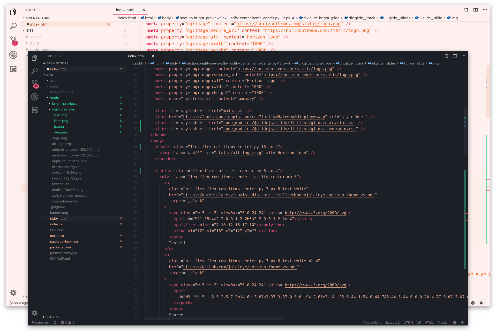

## Dúvidas do Sli.do

### o que significa os operadores << e >> ? exemplo: console.log(5 << 6)
Operadores bit-a-bit realizam as operações em representações binárias, mas retornam valores numéricos no padrão Javascript.
Ver mais: [Operadores bit-a-bit](https://developer.mozilla.org/pt-BR/docs/Web/JavaScript/Reference/Operators/Bitwise_Operators)

### Temas/Cores VSCode


*[catálogo de temas](https://marketplace.visualstudio.com/search?target=VSCode&category=Themes&sortBy=Installs)*


*[tema que eu uso - Horizon](https://marketplace.visualstudio.com/items?itemName=jolaleye.horizon-theme-vscode)*

----

### Exercício
1. Vamos escrever um programa que receba um número. Se o número for múltiplos de 3 o console imprimirá a palavra “Fizz”. Se for múltiplo de 5 mostraremos “Buzz”. Agora, se ele for múltiplo de 3 e 5 mostre “FizzBuzz”.

2. João, Pescador, comprou um microcomputador para controlar o rendimento diário de seu trabalho. Toda vez que ele traz um peso de peixes maior que o estabelecido pelo regulamento de pesca do estado de São Paulo (50 quilos) deve pagar uma multa de R$ 4,00 por quilo excedente. João precisa que você faça um programa que leia a variável peso (peso de peixes) e verifique se há excesso. Se houver, gravar na variável excesso e na variável multa o valor da multa que João deverá pagar. Caso contrário mostrar tais variáveis com o conteúdo ZERO.

3. Escreva um programa que pergunte a quantidade de km percorridos por um carro alugado pelo usuário, assim como a quantidade de dias pelos quais o carro foi alugado. Calcule o preço a pagar, sabendo que o carro custa 60,00 reais por dia e 0,15 centavos por km rodado.


----


### Estrutura switch case
Se a condição for correspondida, o programa executa as instruções asssociadas. Se múltiplos casos corresponderem o valor, o primeiro caso que corresponder é selecionado, mesmo se os casos não forem iguais entre si.

```javascript
var dia = 'Segunda';

switch ( dia ) {
	case 'Segunda':
		console.log('😴');
		break;
	case 'Terça':
		console.log('😐');
		break;
	case 'Quarta':
		console.log('🙂');
		break;
	case 'Quinta':
		console.log('😬');
		break;
	case 'Sexta':
		console.log('🤪');
		break;
	case 'Sábado':
		console.log('😎');
		break;
	case 'Domingo':
		console.log('😞');
		break;
	default:
		console.log('Não achei sua condição.');
}
```

### Importância do break (switch case)
A instrução opcional break associada com cada case garante que o programa saia da condicional switch assim que a instrução correspondente for executada  e executa a instrução que segue logo após o switch. Caso break seja omitido, o programa continua a execução para a próxima instrução dentro de switch. 

Se você esquecer um break então o script irá rodar a partir do caso onde o critério foi correspondido e irá rodar também o caso seguinte independentemente do critério ter sido correspondido ou não:


```javascript
var dia = 'Segunda';

switch ( dia ) {
	case 'Segunda':
		console.log('😴');
	case 'Terça':
		console.log('😐');
	case 'Quarta':
		console.log('🙂');
	case 'Quinta':
		console.log('😬');
	case 'Sexta':
		console.log('🤪');
	case 'Sábado':
		console.log('😎');
	case 'Domingo':
		console.log('😞');
	default:
		console.log('Não achei sua condição.');
}
```

### Operador ternário
O operador condicional (ternário) é o único operador JavaScript que possui três operandos. Este operador é frequentemente usado como um atalho para a instrução if.

```javascript
var idade = 16;

var acesso = idade > 18 ? true : false;
```

A expressão antes do ? é a condição if, se for verdadeira o primeira ação é executada, caso contrário a segunda ação, a que vem depois dos :, é executada

É muito útil para testes mais básicos em que se tem apenas uma única linha de código dentro do if ou do else.

```javascript
var salario = 1000;
var bonus = salario * (salario > 1000 ? 0.10 : 0.15);
```


----

### Extras

toFixed - https://developer.mozilla.org/pt-BR/docs/Web/JavaScript/Reference/Global_Objects/Number/toFixed

parseFloat - https://developer.mozilla.org/pt-BR/docs/Web/JavaScript/Reference/Global_Objects/parseFloat

parseInt - https://developer.mozilla.org/pt-BR/docs/Web/JavaScript/Reference/Global_Objects/parseInt